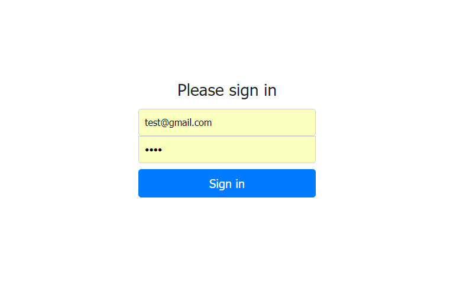
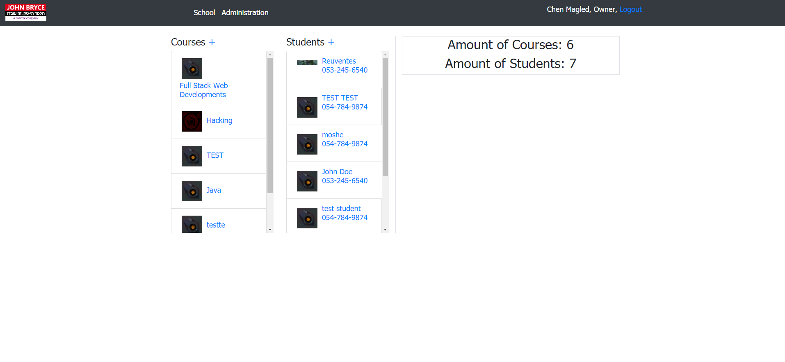
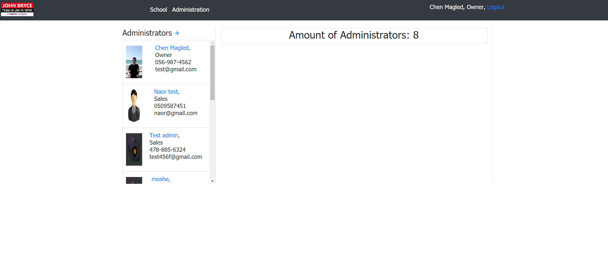
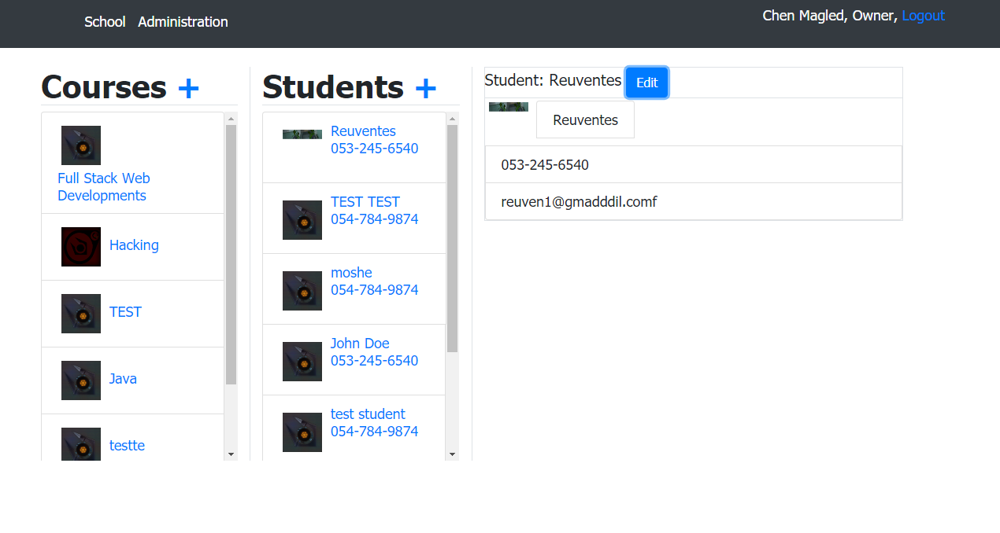
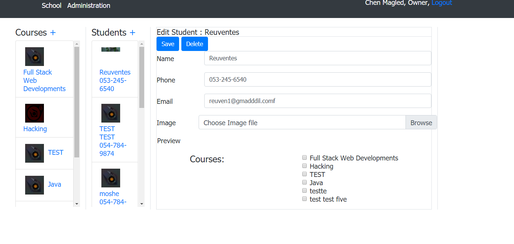
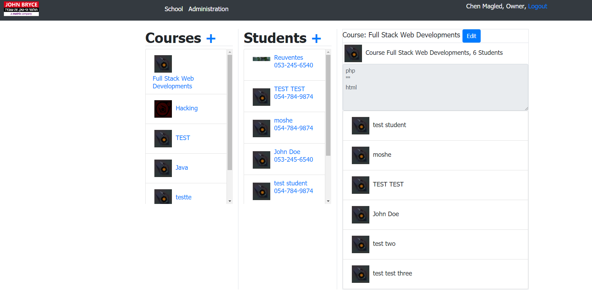
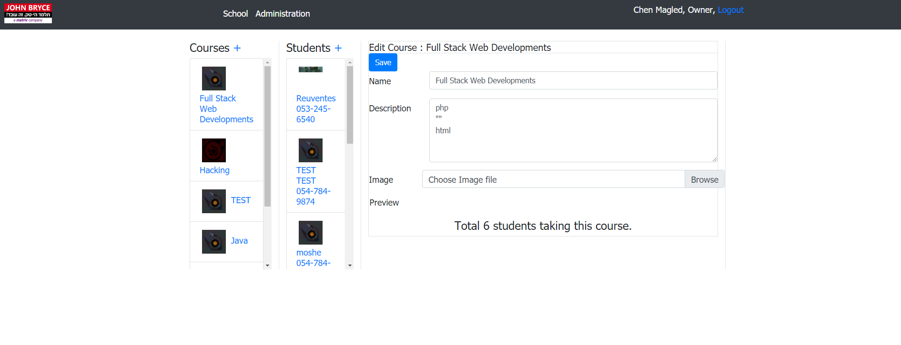
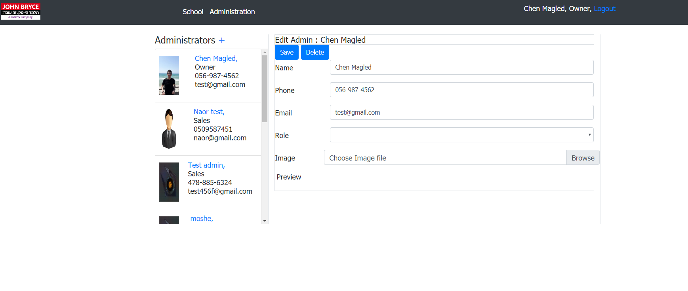

# The School
* A project that was developed with PHP language and MVC architecture pattern.

* Management system of students, courses and school staff.

## topics:

### HTML + CSS :
* HTML5 Structre
* Bootstrap Design

### PHP :
* MVC Structre
* Routing
* Object Oriented
* Password encryption

### MySQL :
* Design & create schema
* Queries

***

## Requirements:

1. PHP environment.
2. MySQL Database.

## How to run:

1. Copy the Application files to your host ("mvc" and "inc" should be one directory before public_html).
2. Configure the config.php file to suit your MySQL database connection.
3. Run the sql file on your database, so you will have all the tables needed.
4. Enter your website and than login to the owner account.

***

### Login:

### School Home:

### Admin Home:

### Student View:

### Student Edit:

### Course View:

### Course Edit:

### Admin Edit:

